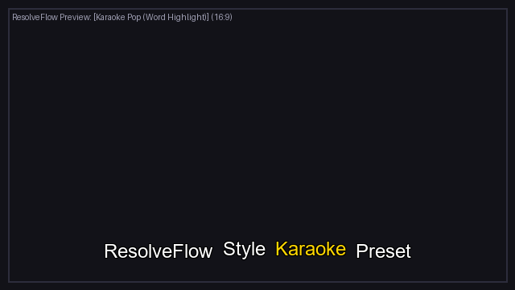
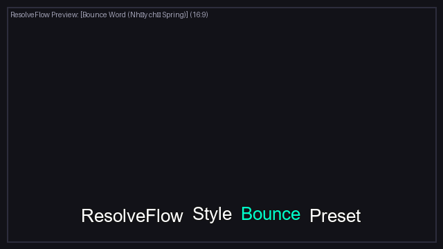
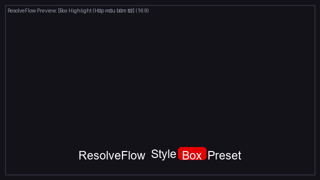
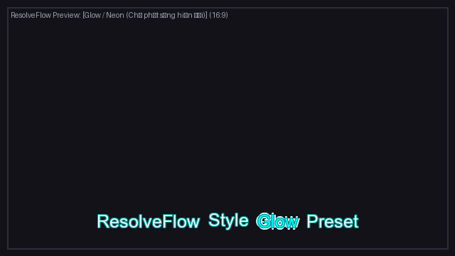
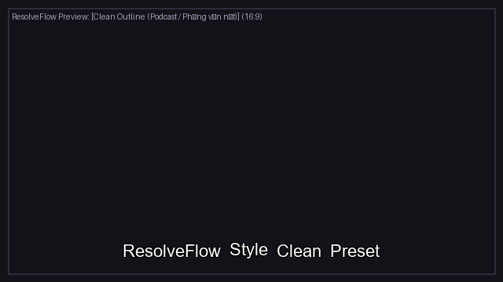
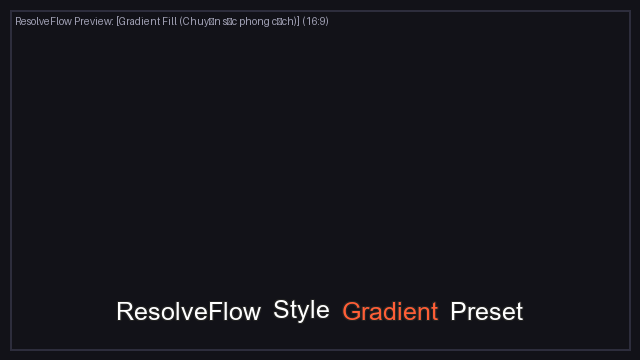
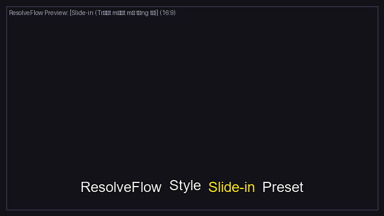

# 🚀 ResolveFlow Assistant v4.1 - AI Visual, Director, Text+ Presets & Smart Performance Suite

[](https://github.com/NguyenVanTruong06/ResolveFlow-Assistant/actions/workflows/test.yml)
[](LICENSE)
[](https://www.python.org/)
[](https://www.blackmagicdesign.com/products/davinciresolve)

> **GitHub Topics:** `davinci-resolve`, `whisper-ai`, `video-editing`, `automation`, `fcpxml`, `ai-director`, `pyside6`, `speech-to-text`, `video-production`

**ResolveFlow Assistant v4.1** là bộ công cụ trợ lý AI toàn năng tự động hóa quy trình hậu kỳ video 100% cục bộ (Local / On-Premise) dành cho **DaVinci Resolve** (Hỗ trợ cả bản **Free** và bản **Studio**).

Hệ thống tích hợp công nghệ AI nhận dạng giọng nói ngoại tuyến (Whisper AI), bộ não **Đạo Diễn AI (AI Director)** tự động phân tích kịch bản lời thoại, lọc sạch nói vấp (Bad Takes), thị giác máy tính **Auto Dynamic Re-framing 9:16 (Bám mặt chuyển video dọc)**, **AI B-Roll Inserter (Tự động gợi ý cảnh minh họa Track Video 2)**, **Auto SFX Engine (Hiệu ứng âm thanh Track Audio 2)**, **Auto Speed-Ramp 8x (Tua nhanh khoảng lặng thành cú chuyển cảnh Timelapse)**, hiệu ứng **Auto Punch-in (Zoom luân phiên 1.15x)**, **Hệ thống Text Style Presets đa phong cách (Karaoke Pop, Bounce Word, Box Highlight, Glow/Neon, Clean Outline, Gradient Fill, Slide-in)**, **Bộ chọn Workflow Mode 1-click & Hệ thống Recipe**, cùng cơ chế **Scan Cache siêu tốc (<0.05s)** và **Video Proxy 480p**.

---

## 📑 Bảng So Sánh Các Phiên Bản

| Tính năng | Bản v1.0 - v3.0 | Bản v4.0 | Bản v4.1 (Hiện tại - Nâng cấp Toàn diện) |
| :--- | :---: | :---: | :---: |
| **Mục tiêu sử dụng** | Cắt thô & Lọc nói vấp | Đa tầng thị giác & Speed-Ramp | **Workflow Mode 1-click (Podcast, Shorts, Vlog, Advanced)** |
| **Text Style Presets** | Phụ đề cơ bản | Karaoke chữ nhảy đơn giản | **7 Preset CapCut-like Text+ (Pop, Bounce, Box, Glow, Outline...) + Quick Preview** |
| **UX & Cấu hình** | 1 Lớp cài đặt | Giao diện cơ bản | **2 Lớp (Cơ bản + Master Slider / Nâng cao ▾) & Hệ thống Recipe 1-click** |
| **Tốc độ Quét (Scanning)** | Chạy trực tiếp file gốc | Quét tuần tự | **Scan Cache theo Checksum (<0.05s) + Proxy 480p & Pipeline song song** |
| **Gợi ý Whisper Model** | Người dùng tự chọn | Người dùng tự chọn | **Tự động gợi ý model tối ưu theo thời lượng video** |
| **Kiểm tra chẩn đoán (Dry-run)** | Kiểm tra cơ bản | Kiểm tra cơ bản | **Dry-run FCPXML Integrity, kiểm tra Media Offline & tiếng Việt UTF-8** |
| **Cắt khoảng lặng & Speed-Ramp** | Cắt thô | Speed-Ramp 8x | **Speed-Ramp 8x kết hợp Master Intensity Slider** |
| **Lọc nói vấp & Đạo diễn AI** | Cơ bản | Gợi ý 2 Pha duyệt cắt | **Quy trình 2 Pha (Phase 1 AI Review / Phase 2 Xuất bản)** |
| **Auto Re-framing (16:9 ➔ 9:16)** | ❌ | Bám mặt chuyển dọc | **Tự động bám mặt & căn chỉnh vị trí Text+ theo tỷ lệ** |
| **Gợi ý B-Roll & SFX Audio 2** | ❌ | Xuất Markers & Cues | **Tự động chèn Markers & Cues B-Roll, SFX, Timelapse** |
| **Tương thích DaVinci Resolve** | Free & Studio | Free & Studio | **100% Resolve Free & Studio (FCPXML v1.9 + EDL CMX3600)** |

---

## 🎨 Hệ Thống Text Style Presets (Text+/Fusion Text)

Hệ thống cho phép lựa chọn hoặc tự tạo các kiểu dáng phụ đề động hiện đại chuẩn phong cách CapCut/VN Video Editor, xuất trực tiếp sang dạng **Text+/Fusion Text** trong DaVinci Resolve (không bị burn-in cứng vào video):

| Preset | Kiểu Hoạt Ảnh (Animation) | Xem Trước Giao Diện (Preview) |
| :--- | :--- | :--- |
| **1. Karaoke Pop** | Word Highlight phóng to 25% đổi màu vàng |  |
| **2. Bounce Word** | Từ nảy nhịp nhàng Spring Curve |  |
| **3. Box Highlight** | Khung nền hộp bo góc bám theo từ |  |
| **4. Glow / Neon** | Chữ phát sáng Neon Cyan rực rỡ |  |
| **5. Clean Outline** | Chữ tĩnh viền nét thanh lịch cho Podcast |  |
| **6. Gradient Fill** | Màu dải chuyển sắc mềm mại |  |
| **7. Slide-in** | Trượt chữ mượt mà từng từ |  |

---

## ⚡ Tải Bản Đóng Gói Sẵn (.exe Standalone)

> **Dành cho Người Dùng Cuối (Không cần cài đặt Python hay cấu hình dòng lệnh):**

1. Truy cập trang **[GitHub Releases](https://github.com/NguyenVanTruong06/ResolveFlow-Assistant/releases)** của repository.
2. Tải về tệp nén mới nhất: **`ResolveFlow-Assistant-v4.1.0-windows-x64.zip`**.
3. Giải nén tệp `.zip` vào bất kỳ thư mục nào trên máy tính (ví dụ: `D:\ResolveFlow\`).
4. Nhấp đúp chuột vào file **`ResolveFlow-Assistant.exe`** để mở ứng dụng.
5. *Lưu ý khởi chạy lần đầu:* Khi bạn chọn một mô hình Whisper AI mới (ví dụ: `small` hoặc `medium`), ứng dụng sẽ tự động tải mô hình về bộ nhớ đệm máy tính kèm thanh thông báo tiến trình rõ ràng (chỉ diễn ra 1 lần duy nhất).

---

## 🛠️ Cài Đặt Dành Cho Lập Trình Viên (Từ Mã Nguồn)

### 1. Yêu cầu hệ thống
* **Hệ điều hành:** Windows 10/11 (64-bit). *(Xem thêm: [Báo cáo tương thích macOS](docs/MACOS_COMPATIBILITY_ANALYSIS.md))*
* **Python:** Phiên bản `3.10` hoặc `3.11`.
* **GPU (Khuyên dùng):** NVIDIA (hỗ trợ CUDA) để tăng tốc độ nhận diện Whisper AI.
* **Công cụ bắt buộc:** [FFmpeg](https://ffmpeg.org/) (đã thêm vào biến môi trường `PATH`).

### 2. Cài đặt mã nguồn nhanh (1-Click)
```powershell
# 1. Clone mã nguồn về máy
git clone https://github.com/NguyenVanTruong06/ResolveFlow-Assistant.git
cd ResolveFlow-Assistant

# 2. Chạy script thiết lập tự động
powershell -ExecutionPolicy Bypass -File setup_project.ps1
```

Hoặc cài đặt thủ công bằng virtualenv:
```powershell
python -m venv venv
.\venv\Scripts\Activate.ps1
pip install -r requirements.txt
pip install pyinstaller
```

### 3. Tự đóng gói Standalone Executable (.exe)
```powershell
python build_standalone.py
```
File `.exe` sẽ được tạo tại `dist/ResolveFlow-Assistant/ResolveFlow-Assistant.exe`.

---

## 📖 Hướng Dẫn Sử Dụng Chi Tiết (Bản v4.1)

Chạy ứng dụng bằng cách double-click file **`Run_ResolveFlow.bat`** hoặc lệnh:
```powershell
python main.py
```

---

### 🟢 1. Bộ Chọn Chế Độ Dựng Nhanh (Workflow Mode)
* **🎙 Dựng Podcast / Phỏng vấn dài:** Tự động bật Silence Cut + Lọc sạch nói vấp + Clean Talk + Sub chuẩn viền nét thanh lịch (`clean_outline`).
* **📱 Làm Shorts / TikTok 9:16:** Tự động bật Viral Shorts + Auto Reframe 9:16 + Sub Karaoke Pop nhảy chữ (giới hạn 4-6 từ) + Auto SFX + Auto Punch-in.
* **🎬 Vlog có Hook / Intro:** Tự động trích xuất Teaser/Hook mở đầu giật gân (10-30s) + Punch-in + B-Roll + Speed-Ramp tua nhanh Timelapse.
* **⚙ Tùy chỉnh nâng cao (Advanced):** Mở toàn bộ 6 nhóm chức năng để người dùng tùy biến đè (override) bất kỳ lúc nào.

---

### 🟢 2. Hệ Thống Recipe (Cấu Hình 1-Click)
* Cho phép lưu toàn bộ trạng thái cài đặt vào `recipes/<tên_recipe>.json`.
* Nạp lại bằng 1 click chọn trong dropdown Recipe thay vì phải cấu hình lại từ đầu.

---

### 🟢 3. Tối Ưu Hiệu Năng & Scan Cache
* **Scan Cache theo Checksum:** Nạp lại kết quả nhận diện giọng nói và cắt lọc trong **0.05s** nếu chạy lại cùng file video gốc.
* **Gợi ý Model Whisper:** Tự động tính thời lượng video để gợi ý `large-v3` (< 3 phút) hoặc `small`/`medium` (> 30 phút, tiết kiệm 65-75% thời gian).

---

## 🧪 Chạy Kiểm Thử Tự Động (Unit Tests)
```powershell
.\venv\Scripts\pytest -v
```
Toàn bộ **68/68 kịch bản kiểm thử** đạt kết quả **100% PASSED**.

---

## 📄 Giấy Phép (License)
Dự án được phân phối dưới giấy phép **[MIT License](LICENSE)**.