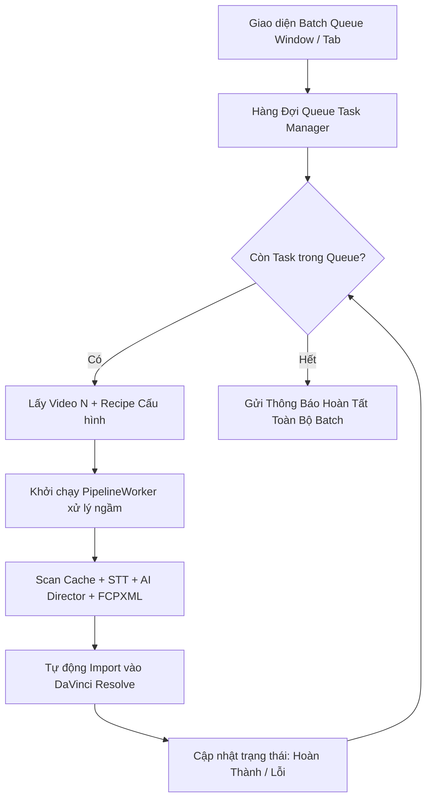

# 📋 Lộ Trình Phát Triển: Xử Lý Hàng Loạt (Batch Queue Automation)

## 1. Bối Cảnh & Nhu Cầu
Người làm podcast, studio sản xuất nội dung số và các kênh YouTube/TikTok thường quay hàng loạt tập (5-20 video/ngày) với cùng một phong cách dựng (cùng một Recipe).
Tính năng **Batch Queue** cho phép người dùng nạp một danh sách các video nguồn, áp dụng 1 Recipe chung (hoặc gán Recipe riêng cho từng video), sau đó bấm "Start Queue" để hệ thống tự động xử lý tuần tự qua đêm mà không cần người trực máy.

---

## 2. Kiến Trúc Thiết Kế Kỹ Thuật

### Các Tính Năng Trọng Tâm:
1. **Quản lý Hàng Đợi (Queue Item List):**
   - Thêm video hàng loạt bằng kéo thả (Drag & Drop) hoặc chọn thư mục (Watch Folder).
   - Chọn Recipe áp dụng chung hoặc tùy biến riêng cho từng item.
   - Ưu tiên thứ tự (Move Up / Move Down), Xóa hoặc Tạm dừng (Pause / Resume).
2. **Xử Lý Lỗi Cách Ly (Fault Tolerance):**
   - Nếu 1 video bị lỗi (file hỏng, codec không hỗ trợ), hệ thống ghi log lỗi, bỏ qua và tự động chuyển sang video tiếp theo mà không làm sập toàn bộ hàng đợi.
3. **Báo Cáo Tổng Hợp Sau Batch (Batch Summary Audit):**
   - Xuất file báo cáo Markdown tổng hợp toàn bộ các video đã xử lý: tổng thời lượng cắt, số lượng phụ đề tạo ra, số lượng B-Roll/SFX đã chèn.

---

## 3. Kế Hoạch Triển Khai (Milestones)
- **Giai đoạn 1:** Xây dựng `QueueManager` & data model `BatchTaskItem` trong `src/core/queue.py`.
- **Giai đoạn 2:** Thiết kế tab / cửa sổ giao diện `BatchQueueWidget` trong `src/ui/`.
- **Giai đoạn 3:** Tích hợp cơ chế Auto-Retry & Thông báo âm thanh/Notification khi hoàn thành toàn bộ batch.
