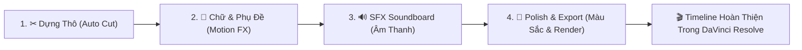

# 📖 HƯỚNG DẪN SỬ DỤNG CHI TIẾT RESOLVEFLOW ASSISTANT v4.1
### *Bộ Công Cụ Tự Động Hóa Dựng Phim, Thị Giác & Âm Thanh Chuyên Sâu Cho DaVinci Resolve*

---

## 📑 MỤC LỤC
1. [Giới Thiệu & Kiến Trúc Tổng Quan](#1-giới-thiệu--kiến-trúc-tổng-quan)
2. [Tab 1: Dựng Thô & Cắt Tự Động (Auto Cut & AI Director)](#2-tab-1-dựng-thô--cắt-tự-động-auto-cut--ai-director)
3. [Tab 2: Thư Viện Kỹ Xảo Chữ & Motion Technique (Eyecandy Style)](#3-tab-2-thư-viện-kỹ-xảo-chữ--motion-technique-eyecandy-style)
4. [Tab 3: SFX Soundboard Studio & Audio Enhancer](#4-tab-3-sfx-soundboard-studio--audio-enhancer)
5. [Tab 4: Chuẩn Màu Điện Ảnh & Xuất Bản 1-Click (Shotdeck Style)](#5-tab-4-chuẩn-màu-điện-ảnh--xuất-bản-1-click-shotdeck-style)
6. [Khả Năng Tương Thích DaVinci Resolve Bản Thường (Free) & Studio](#6-khả-năng-tương-thích-davinci-resolve-bản-thường-free--studio)
7. [Các Phím Tắt & Mẹo Làm Việc Nhanh (Pro Tips)](#7-các-phím-tắt--mẹo-làm-việc-nhanh-pro-tips)

---

## 1. GIỚI THIỆU & KIẾN TRÚC TỔNG QUAN

**ResolveFlow Assistant v4.1** là trợ lý dựng phim thông minh, kết nối trực tiếp với **DaVinci Resolve** để biến những công đoạn dựng thủ công nhàm chán thành quy trình tự động hóa chỉ trong vài giây:

### Bố cục giao diện 2 phần (QSplitter Layout):
* **Cột Trái (Rộng ~65%)**: 4 Tab chức năng chính tương ứng với 4 giai đoạn dựng phim.
* **Cột Phải (Rộng ~35%)**: Khung giám sát tiến trình, Bảng duyệt phân đoạn AI Director (Review Table) và Console Log chi tiết thời gian thực.

---

## 2. TAB 1: DỰNG THÔ & CẮT TỰ ĐỘNG (AUTO CUT & AI DIRECTOR)

### 🚀 1. Chế Độ 1-Click Workflow Mode
* **🎙 Podcast / Phỏng vấn**: Tự động lọc sạch khoảng lặng âm lượng (`-38 dB`), ngắt câu chuẩn mực, loại bỏ câu nói vấp.
* **📱 Shorts / TikTok (9:16)**: Tự động kích hoạt **Auto-Reframe 9:16** nhận diện khuôn mặt, cắt nhịp nhanh, ngắt dòng kiểu ngắn (`words mode`).
* **📹 Vlog Mở Rộng**: Tự động bật **Tua nhanh khoảng lặng (Speed-Ramp 8x)** và **Tạo Teaser mở đầu (Vlog Hook 15s)**.
* **⚙️ Tùy Chỉnh Nâng Cao**: Toàn quyền tùy biến các thông số chi tiết.

### ✂ 2. Cắt Khoảng Lặng (Silence Cut) & Tua Nhanh (Speed-Ramp)
* **Ngưỡng âm lượng cắt (dB Threshold)**: Mặc định `-35 dB`. Kéo sang trái (ví dụ `-42 dB`) để cắt nhẹ nhàng hơn, kéo sang phải (ví dụ `-28 dB`) để cắt sát hơn.
* **Thời lượng tối thiểu (Min Duration)**: Khoảng lặng kéo dài hơn thời gian này mới bị xử lý (mặc định `0.5s`).
* **⚡ Tua nhanh khoảng lặng (Speed-Ramp)**: Thay vì cắt bỏ hoàn toàn, hệ thống sẽ **tua nhanh x8 lần** các đoạn không có tiếng nói, tạo cảm giác Timelapse hiện đại cho Vlog.

### 🤖 3. AI Director (Loại Bỏ Bad Takes & Phê Duyệt 2 Bước)
1. **Phân tích thông minh**: Whisper AI quét toàn bộ lời thoại và phát hiện các câu nói bị vấp, lặp từ, sửa lỗi hoặc câu thử nghiệm.
2. **Quy trình Phê duyệt 2 Bước (Phase Review)**:
   * **Phase 1**: Khi phát hiện có cảnh lỗi, hệ thống hiển thị **Bảng Duyệt (Review Table)** bên cột phải. Bạn có thể bấm tick chọn/bỏ chọn từng câu.
   * **Phase 2**: Bấm nút **"🚀 Tiếp tục xuất bản Timeline"** để sinh Timeline DaVinci Resolve sạch bóng lỗi.

---

## 3. TAB 2: THƯ VIỆN KỸ XẢO CHỮ & MOTION TECHNIQUE (EYECANDY STYLE)

Tab 2 cung cấp thư viện phong cách chữ và kỹ thuật chuyển động (*Visual Technique Library*) lấy cảm hứng từ **Eyecandy** và **Mixkit**:

### 🃏 1. Thư Viện Kỹ Xảo Thị Giác Sẵn Có:
* 💥 **Alex Hormozi Pop**: Chữ nảy lò xo (*Spring curve*) bám từng từ khóa chính, màu vàng neon/xanh chuối viền đen dày tương phản cao cho Shorts/Reels triệu view.
* 🖍️ **Highlighter Marker**: Khung màu vàng dạ quang quét sau lưng từ khóa như động tác tô bút nhớ dòng tài liệu.
* 📄 **Paper Cutout Vintage**: Nhãn dán xé giấy thủ công Stop-motion, tông giấy ngà hoài niệm.
* ⚡ **RGB Split Glitch**: Tách kênh màu quang sai (*Chromatic Aberration*) đỏ - xanh kèm viền phát quang điện tử.
* 🟣 **Neon Pulse Glow**: Ống đèn huỳnh quang Neon tím/cyan phát sáng tỏa bóng mờ ảo.
* 📺 **90s VHS Camcorder**: Phông chữ monospaced màu vàng cam viền đen phong cách máy quay băng thập niên 90.
* 🧊 **Clean Minimal**: Tối giản, thanh lịch, chuẩn mực cho Podcast & phỏng vấn chuyên sâu.
* 🎤 **Karaoke Pop / Bounce Word / Gradient Sunset / Box Highlight**.

### 🖱 2. Ba Cách Chèn Kiểu Chữ Vào DaVinci Resolve:
1. **Cách 1: Kéo - Thả Trực Tiếp (Drag & Drop)**:
   * Nhấn giữ chuột vào bất kỳ thẻ kỹ xảo nào trên ResolveFlow và **kéo thả thẳng sang Timeline DaVinci Resolve**.
   * Đoạn text trên timeline sẽ lập tức biến đổi sang kiểu dáng đó mà **không bị mất nội dung lời thoại**.
2. **Cách 2: Chèn Tại Con Trỏ Playhead**:
   * Nhập nội dung vào ô *"Nội dung Text"* -> Chọn thời lượng (ví dụ `3.0s`) -> Bấm nút **"🚀 Chèn Tiêu Đề Vào Playhead"**.
3. **Cách 3: Cài Đặt 1-Click Vào Thư Viện DaVinci Resolve**:
   * Bấm nút **"📥 Cài Đặt Toàn Bộ Presets Vào DaVinci Resolve"**.
   * Mở DaVinci Resolve: Toàn bộ các template sẽ xuất hiện tại mục **`Effects -> Titles -> ResolveFlow`**.

---

## 4. TAB 3: SFX SOUNDBOARD STUDIO & AUDIO ENHANCER

### 🎹 1. Lưới 8-Pad Soundboard Nghe Thử Tức Thì:
* 🌬 **Whoosh**: Tiếng lướt gió nhanh dùng cho chuyển cảnh hoặc chuyển slide.
* 💥 **Pop**: Tiếng bong bóng nảy dùng lúc từ khóa phụ đề bật lên.
* 🔔 **Ding**: Tiếng chuông nhẹ nhàng dùng khi xuất hiện số liệu, icon hoặc lời khuyên quan trọng.
* 🖱 **Click**: Tiếng bấm chuột công nghệ.
* 📸 **Camera Shutter**: Tiếng chụp ảnh màn hình hoặc đóng băng khung hình (Freeze Frame).
* ⚡ **Glitch**: Tiếng rè nhiễu sóng số cho hiệu ứng chuyển cảnh điện tử.
* 📈 **Riser**: Âm thanh dồn dập tạo cao trào kịch tính.
* 🔊 **Deep Sub**: Tiếng bass trầm rung chuyển cho những phát biểu trọng tâm.

### ⚡ 2. Hai Chế Độ Chèn Âm Thanh:
* **Tự Động Bằng AI (AI Auto-SFX)**: Khi tích chọn ở Tab 1, hệ thống tự động chèn Whoosh, Pop, Ding vào đúng nhịp lời thoại trên **Audio Track 2 & 3**.
* **Chèn Thủ Công**: Bấm chọn Pad âm thanh -> Chọn Track Audio và mức âm lượng (`-12 dB`) -> Bấm **"🚀 Chèn SFX Vào Vị Trí Playhead"** (hoặc bấm *"Mở Thư Mục SFX..."* để kéo thả file `.wav`).

---

## 5. TAB 4: CHUẨN MÀU ĐIỆN ẢNH & XUẤT BẢN 1-CLICK (SHOTDECK STYLE)

### 🎨 1. Bộ Sưu Tập 10 Tone Màu & 3D LUTs (.cube):
* 🌸 **Korean Pastel Soft Dream**: Phong cách K-Drama dịu mắt, nâng sáng vùng tối, mịn màng da mặt.
* ⚡ **Cyberpunk Neon Nights**: Tương phản cao, bóng tối ngả tím Indigo, ánh sáng hồng neon & cyan.
* 🦇 **Moody Dark Cinema**: U tối kịch tính, chiều sâu bóng đổ kiểu phim trinh thám Hollywood.
* 🎬 **Cinematic Teal & Orange**: Tương phản xanh Teal hậu cảnh và da cam ấm áp.
* ☀️ **Warm Vlog Lifestyle**: Tươi tắn, ấm áp, sáng hồng làn da.
* 🌅 **Golden Hour Sunset**: Nắng chiều hoàng hôn mật ong ấm áp lãng mạn.
* 🎨 **Anime Studio Ghibli**: Rực rỡ tươi tắn (+25% bão hòa), xanh biếc màu trời và cỏ cây.
* 🎞 **Vintage Kodak 2383 Print**: Màu phim nhựa 35mm hoài niệm thập niên 90.
* 🖤 **Noir High Contrast B&W**: Đen trắng tương phản cao nghệ thuật.
* 🌿 **Clean Rec.709 Natural**: Màu chuẩn truyền hình tự nhiên, trong trẻo.

### 🚀 2. Xuất Bản 1-Click (Deliver Page Render Queue):
* **📱 TikTok / Shorts (9:16)**: 1080x1920 60fps - 15Mbps (Tối ưu thuật toán TikTok/Reels).
* **📺 YouTube Full HD (16:9)**: 1920x1080 60fps - 25Mbps.
* **💎 YouTube 4K Master (16:9)**: 3840x2160 60fps - H.265 Master Profile.
* **🎙 Podcast Audio Only**: WAV 48kHz Master / MP3 320kbps.
* *Thao tác*: Chọn preset -> Nhập tên file -> Bấm **"🚀 Thêm Vào Render Queue & Bắt Đầu Render"**.

---

## 6. KHẢ NĂNG TƯƠNG THÍCH DAVINCI RESOLVE BẢN THƯỜNG (FREE) & STUDIO

> [!NOTE]
> **ResolveFlow Assistant hoàn toàn tương thích 100% trên cả DaVinci Resolve Bản Thường (Miễn phí) lẫn Bản Studio!**

1. **FCPXML v1.9 & EDL CMX3600**: Định dạng trao đổi tiêu chuẩn công nghiệp, Resolve Free nhập và link media tức thì.
2. **Fusion Macro (`.setting`)**: DaVinci Resolve Free đọc và render toàn bộ hiệu ứng chữ động, shading và animation curve mà không bị watermark.
3. **3D LUTs (`.cube`)**: Định dạng chuẩn 33x33x33 tương thích gốc trên Color Page của Resolve Free.
4. **Không yêu cầu Plugin bên thứ 3**: Mọi thứ chạy độc lập, nhẹ nhàng và an toàn.

---

## 7. CÁC PHÍM TẮT & MẸO LÀM VIỆC NHANH (PRO TIPS)

| Thao Tác | Phím Tắt / Thao Tác | Mô Tả |
| :--- | :--- | :--- |
| **Chọn nhanh Video** | **Kéo thả chuột (Drag & Drop)** | Kéo tệp video trực tiếp từ File Explorer vào cửa sổ ứng dụng. |
| **Dán Fusion Node** | **Ctrl + V** | Bấm nút *"📋 Copy Fusion Node"* trên ResolveFlow rồi sang DaVinci Resolve bấm `Ctrl + V`. |
| **Kéo Thả Kỹ Xảo Chữ** | **Nhấn giữ chuột trái & Kéo** | Kéo thẻ kỹ xảo từ Tab 2 thả vào đoạn clip trên Timeline DaVinci Resolve. |
| **Kéo Thả LUT Màu** | **Nhấn giữ chuột trái & Kéo** | Kéo thẻ màu từ Tab 4 thả vào Color Page DaVinci Resolve. |
| **Xem trước kiểu chữ** | **Nút "👁 Xem Trước Lớn"** | Mở cửa sổ giả lập video để xem trước hoạt ảnh chữ nảy mà không cần mở Resolve. |
