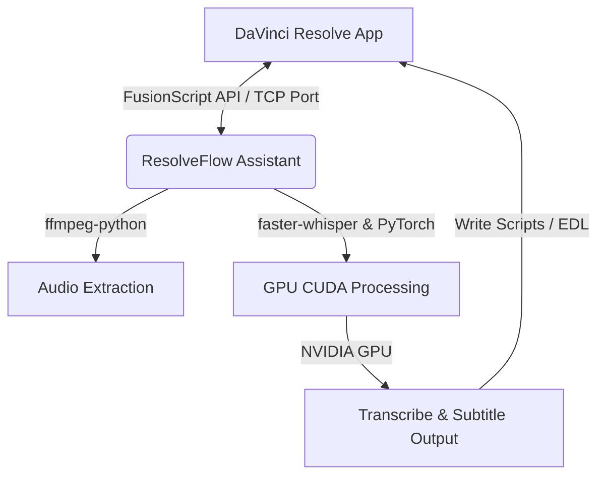

# Software Requirements Specification (SRS)
## Dự án: ResolveFlow Assistant (AI Video Automation Suite for DaVinci Resolve)

---

## Lịch sử sửa đổi (Revision History)

| Phiên bản | Ngày | Tác giả | Mô tả thay đổi |
| :--- | :--- | :--- | :--- |
| 1.0 | 24/08/2026 | Nguyễn Văn Trường / Antigravity | Khởi tạo tài liệu đặc tả SRS ban đầu cho ResolveFlow Assistant |
| 2.0 | 24/08/2026 | Nguyễn Văn Trường / Antigravity | Nâng cấp SRS lên v2.0: Quy trình dựng đa góc quay/đa clip và Phụ đề động Kinetic animated |

---

## MỤC LỤC
1. [GIỚI THIỆU (INTRODUCTION)](#1-giới-thiệu-introduction)
   - [Mục đích (Purpose)](#11-mục-đích-purpose)
   - [Phạm vi (Scope)](#12-phạm-vi-scope)
   - [Thuật ngữ và viết tắt (Definitions, Acronyms, and Abbreviations)](#13-thuật-ngữ-và-viết-tắt-definitions-acronyms-and-abbreviations)
   - [Tài liệu tham khảo (References)](#14-tài-liệu-tham khảo-references)
   - [Tổng quan tài liệu (Overview)](#15-tổng-quan-tài-liệu-overview)
2. [MÔ TẢ TỔNG QUAN (GENERAL DESCRIPTION)](#2-mô-tả-tổng-quan-general-description)
   - [Bối cảnh sản phẩm (Product Perspective)](#21-bối-cảnh-sản-phẩm-product-perspective)
   - [Các chức năng chính (Product Functions)](#22-các-chức-năng-chính-product-functions)
   - [Đặc điểm người dùng (User Characteristics)](#23-đặc-điểm-người-dùng-user-characteristics)
   - [Ràng buộc chung (General Constraints)](#24-ràng-buộc-chung-general-constraints)
   - [Giả định và Phụ thuộc (Assumptions and Dependencies)](#25-giả-định-và-phụ-thuộc-assumptions-and-dependencies)
3. [YÊU CẦU CHI TIẾT (SPECIFIC REQUIREMENTS)](#3-yêu-cầu-chi-tiết-specific-requirements)
   - [Giao diện bên ngoài (External Interface Requirements)](#31-giao-diện-bên-ngoài-external-interface-requirements)
     - [Giao diện người dùng (User Interfaces)](#311-giao-diện-người-dùng-user-interfaces)
     - [Giao diện phần cứng (Hardware Interfaces)](#312-giao-diện-phần-cứng-hardware-interfaces)
     - [Giao diện phần mềm (Software Interfaces)](#313-giao-diện-phần-mềm-software-interfaces)
     - [Giao diện truyền thông (Communications Interfaces)](#314-giao-diện-truyền-thông-communications-interfaces)
   - [Các tính năng hệ thống (System Features)](#32-các-tính-năng-hệ-thống-system-features)
     - [Tính năng 1: Nhận diện giọng nói cục bộ (Local Speech-to-Text)](#321-tính-năng-1-nhận-diện-giọng-nói-cục-bộ-local-speech-to-text)
     - [Tính năng 2: Tạo và Đồng bộ Phụ đề (Subtitle Generation & Alignment)](#322-tính-năng-2-tạo-và-đồng-bộ-phụ-đề-subtitle-generation--alignment)
     - [Tính năng 3: Tự động cắt bỏ khoảng lặng (Smart Silent Cut / Auto-Editor)](#323-tính-năng-3-tự-động-cắt-bỏ-khoảng-lặng-smart-silent-cut--auto-editor)
   - [Yêu cầu hiệu năng (Performance Requirements)](#33-yêu-cầu-hiệu-năng-performance-requirements)
   - [Ràng buộc thiết kế (Design Constraints)](#34-ràng-buộc-thiết-kế-design-constraints)
   - [Thuộc tính hệ thống (Software System Attributes)](#35-thuộc-tính-hệ-thống-software-system-attributes)
     - [Tính khả dụng (Availability)](#351-tính-khả-dụng-availability)
     - [Tính bảo mật (Security)](#352-tính-bảo-mật-security)
     - [Khả năng bảo trì (Maintainability)](#353-khả-năng-bảo-trì-maintainability)
     - [Khả năng chuyển đổi/tương thích (Transferability)](#354-khả-năng-chuyển-đổitương-thích-transferability)
4. [PHỤ LỤC (APPENDIXES) & TRACEABILITY MATRIX](#4-phụ-lục-appendixes--traceability-matrix)

---

## 1. GIỚI THIỆU (INTRODUCTION)

### 1.1 Mục đích (Purpose)
Tài liệu SRS này nhằm xác định chi tiết các yêu cầu nghiệp vụ, chức năng, phi chức năng và thiết kế kiến trúc hệ thống cho công cụ **ResolveFlow Assistant**. Tài liệu này đóng vai trò là kim chỉ nam cho quá trình phát triển mã nguồn, xây dựng các kịch bản kiểm thử (tests) và làm cơ sở thống nhất nghiệm thu kỹ thuật.
* **Đối tượng hướng tới:** Lập trình viên Python, Chuyên viên tối ưu hóa DevOps, Kỹ sư âm thanh/hình ảnh (Video Editors), và nhóm kiểm thử phần mềm (QA/QC).

### 1.2 Phạm vi (Scope)
ResolveFlow Assistant là một phần mềm hỗ trợ tự động hóa (Desktop Automation Suite) chạy độc lập hoặc tích hợp trực tiếp vào DaVinci Resolve để giải quyết bài toán tốn thời gian nhất trong hậu kỳ: **Transcribe giọng nói thành văn bản, tự động chèn phụ đề đồng bộ, và tự động cắt bỏ các đoạn im lặng/lỗi phát âm.**
* **Những gì hệ thống SẼ làm:**
  - Trích xuất luồng âm thanh từ các tệp video của dự án DaVinci Resolve cục bộ bằng `ffmpeg-python`.
  - Thực hiện Speech-to-Text đa ngôn ngữ (ưu tiên tiếng Việt/Anh) ngoại tuyến 100% bằng thư viện `faster-whisper` trên nền tảng phần cứng GPU NVIDIA (CUDA).
  - Tự động dựng phụ đề chuẩn hóa (SRT/VTT) và chèn ngược lại vào Timeline DaVinci Resolve dưới dạng các block Text+/Subtitle chuyên nghiệp qua APIs của Resolve SDK.
  - Phân tích biên độ âm thanh bằng `numpy` và dữ liệu thời gian text để sinh danh sách điểm cắt (Edit Decision List - EDL) giúp cắt nhanh các phần "rác" trên Timeline.
* **Những gì hệ thống SẼ KHÔNG làm:**
  - Không gửi bất kỳ dữ liệu âm thanh/hình ảnh nào lên cloud (đảm bảo bảo mật tuyệt đối cho phim chưa phát hành).
  - Không thay thế các trình dựng video khác ngoài DaVinci Resolve (không hỗ trợ Premiere, Final Cut trong phạm vi pha này).

### 1.3 Thuật ngữ và viết tắt (Definitions, Acronyms, and Abbreviations)

| Thuật ngữ / Viết tắt | Định nghĩa |
| :--- | :--- |
| **Resolve SDK / FusionScript** | Bộ công cụ lập trình giao tiếp với DaVinci Resolve thông qua Python. |
| **STT (Speech-to-Text)** | Công nghệ chuyển đổi giọng nói thành văn bản viết. |
| **Local / On-Premise** | Vận hành hoàn toàn cục bộ trên máy tính của người dùng, không phụ thuộc máy chủ từ xa. |
| **CUDA** | Nền tảng tính toán song song do NVIDIA phát triển để tối ưu hóa tính toán trên GPU. |
| **VRAM** | Bộ nhớ RAM chuyên dụng của card đồ họa. |
| **EDL (Edit Decision List)** | Danh sách chứa các điểm thời gian cắt, ghép nối video/audio. |
| **WER (Word Error Rate)** | Tỷ lệ lỗi từ, dùng để đo lường độ chính xác của mô hình STT. |

### 1.4 Tài liệu tham khảo (References)
1. *IEEE Std 830-1998*, IEEE Recommended Practice for Software Requirements Specifications.
2. *DaVinci Resolve Scripting Guide* (đính kèm trong thư mục cài đặt của DaVinci Resolve Studio).
3. *Faster-Whisper Project Documentation* (Tối ưu hóa tốc độ thực thi Whisper của OpenAI bằng CTranslate2).
4. *FFmpeg-Python wrapper documentation* (Sử dụng FFmpeg một cách trực quan trong Python).

### 1.5 Tổng quan tài liệu (Overview)
Tài liệu này bao gồm 3 phần chính. Phần 1 giới thiệu mục đích, phạm vi và các định nghĩa cốt lõi. Phần 2 phác thảo bức tranh tổng quan về luồng hoạt động, các tác nhân hệ thống và các ràng buộc kỹ thuật. Phần 3 mô tả cụ thể từng tính năng hệ thống kèm theo các chỉ số hiệu năng (Performance metrics) và giao diện phần cứng chi tiết.

---

## 2. MÔ TẢ TỔNG QUAN (GENERAL DESCRIPTION)

### 2.1 Bối cảnh sản phẩm (Product Perspective)
ResolveFlow Assistant hoạt động như một ứng dụng đồng hành (Companion App) hoặc một Script chạy trực tiếp trong môi trường của DaVinci Resolve.

Hệ thống tận dụng tối đa kiến trúc phần cứng cục bộ, đặc biệt là nhân Tensor trên GPU NVIDIA để chạy các mạng nơ-ron xử lý ngôn ngữ tự nhiên ngoại tuyến.

### 2.2 Các chức năng chính (Product Functions)
1. **Quản lý Cấu hình và Tải Mô hình (AI Model Management):** Lựa chọn kích thước mô hình Whisper (Tiny, Base, Small, Medium, Large) tương ứng với tài nguyên VRAM khả dụng của GPU.
2. **Trích xuất Âm thanh Nhanh (Fast Audio Extraction):** Tự động phát hiện vị trí file gốc trong Media Pool của Resolve và trích xuất kênh audio chất lượng cao bằng FFmpeg.
3. **Nhận dạng và Định thời gian giọng nói (Speech-to-Text & Word-level Timestamps):** Tạo văn bản thô kèm mốc thời gian chính xác từng từ để phục vụ căn chỉnh và dựng phụ đề.
4. **Tạo và Vẽ Phụ đề Tự động (Auto Subtitle Burn-In/Generate):** Sử dụng scripting để chèn đối tượng Text+ vào đúng track phụ đề trên Timeline đang hoạt động.
5. **Cắt dựng thông minh (Silent Removal & Outtakes Cut):** Phân tích âm lượng sóng âm kết hợp văn bản dịch để tìm các đoạn "e... à..." hoặc im lặng dài hơn `X` giây và tự động cắt bỏ chúng trên Timeline.

### 2.3 Đặc điểm người dùng (User Characteristics)
* **Video Editor chuyên nghiệp:** Những người yêu cầu tốc độ xử lý nhanh, bảo mật phim cao và độ chính xác của phụ đề tiếng Việt ở mức tối đa. Họ có máy trạm mạnh mẽ với card đồ họa NVIDIA chuyên dụng.
* **Content Creator cá nhân:** Yêu cầu một công cụ dễ dùng "1-click" để xuất nhanh phụ đề mà không cần hiểu sâu về lập trình hay cài đặt các thư viện AI phức tạp.

### 2.4 Ràng buộc chung (General Constraints)
* **Hệ điều hành:** Chỉ chạy trên nền tảng Windows 10/11 64-bit (do các ràng buộc của trình điều khiển CUDA và môi trường làm việc chính của người dùng đích).
* **Phần cứng:** Bắt buộc có card đồ họa rời NVIDIA (kiến trúc Maxwell trở lên, khuyên dùng kiến trúc Ampere/Ada Lovelace với RT Core) để chạy `faster-whisper` trên nền CUDA.
* **Phiên bản DaVinci Resolve:** Hỗ trợ DaVinci Resolve 17, 18 và 19. Một số tính năng scripting nâng cao yêu cầu phiên bản DaVinci Resolve Studio (bản trả phí) do giới hạn API của nhà phát triển Blackmagic Design.

### 2.5 Giả định và Phụ thuộc (Assumptions and Dependencies)
* Giả định rằng hệ thống đích đã được cài đặt Driver NVIDIA bản mới nhất để hỗ trợ thư viện CUDA Toolkit.
* Phụ thuộc vào tính sẵn có của tệp thực thi `ffmpeg.exe` và `ffprobe.exe` trong biến môi trường hệ thống (PATH) để xử lý media.

---

## 3. YÊU CẦU CHI TIẾT (SPECIFIC REQUIREMENTS)

### 3.1 Giao diện bên ngoài (External Interface Requirements)

#### 3.1.1 Giao diện người dùng (User Interfaces)
* **Giao diện dòng lệnh (CLI):** Cung cấp các lệnh trực quan kèm thanh tiến trình dạng phần trăm sinh động (Rich Progress Bar) hiển thị rõ ràng tốc độ giải mã (ví dụ: `25.5x real-time`).
* **Giao diện đồ họa (GUI) (Tùy chọn):** Một bảng điều khiển tối giản (Sleek Dark Mode) sử dụng Tkinter hoặc PyQt có các nút: "Tải dự án", "Bắt đầu Transcribe", "Đồng bộ Resolve".

#### 3.1.2 Giao diện phần cứng (Hardware Interfaces)
* **NVIDIA GPU Interface:** Kết nối và truyền dữ liệu ma trận trực tiếp lên VRAM của GPU thông qua thư viện `PyTorch` và `CTranslate2`. 
* Tự động điều tiết tài nguyên để không gây nghẽn phần cứng (màn hình DaVinci Resolve bị giật lag khi đang render video).

#### 3.1.3 Giao diện phần mềm (Software Interfaces)
* **DaVinci Resolve API (fusionscript):** Sử dụng các module Python `DaVinciResolveScript` để truy cập vào các đối tượng: `Resolve`, `ProjectManager`, `Project`, `MediaPool`, `Timeline`, `Track`, và `TimelineItem`.
* **FFmpeg Wrapper:** Giao tiếp với công cụ dòng lệnh FFmpeg thông qua API của `ffmpeg-python` để xử lý âm thanh không cần giải nén thủ công.

#### 3.1.4 Giao diện truyền thông (Communications Interfaces)
* Vận hành hoàn toàn offline. Không có giao diện kết nối mạng ra Internet ngoài giao thức loopback nội bộ (IPC - Inter-Process Communication) để giao tiếp giữa script Python và cổng API của DaVinci Resolve (thường chạy trên cổng `localhost:port`).

---

### 3.2 Các tính năng hệ thống (System Features)

#### 3.2.1 Tính năng 1: Nhận diện giọng nói cục bộ (Local Speech-to-Text)
* **Mục đích:** Chuyển đổi toàn bộ âm thanh hội thoại trong clip/timeline thành văn bản thô kèm timestamp tương ứng.
* **Trình tự Kích hoạt/Phản hồi (Stimulus/Response):**
  1. Người dùng chọn clip trên Timeline -> Kích hoạt script.
  2. Hệ thống gọi FFmpeg trích xuất âm thanh sang định dạng `.wav` 16kHz mono (chuẩn đầu vào tối ưu cho Whisper).
  3. Load model AI tương thích vào VRAM GPU.
  4. Thực hiện chia nhỏ file âm thanh và chạy mô hình STT.
  5. Trả về cấu trúc dữ liệu JSON lưu các đoạn Text, mốc thời gian Start, End và độ tin cậy (probability).

* **Các yêu cầu chức năng chi tiết:**
  - **FR-1.1:** Hệ thống phải hỗ trợ tùy chọn tự động phát hiện ngôn ngữ nói (Language Detection) hoặc cho phép chọn thủ công.
  - **FR-1.2:** Hệ thống phải hỗ trợ chia nhỏ âm thanh thông minh (Voice Activity Detection - VAD) để lọc bỏ tạp âm và tiếng ồn nền trước khi dịch.

#### 3.2.2 Tính năng 2: Tạo và Đồng bộ Phụ đề (Subtitle Generation & Alignment)
* **Mục đích:** Đưa các đoạn text đã dịch lên timeline DaVinci Resolve tại các mốc thời gian chuẩn xác nhất.
* **Trình tự Kích hoạt/Phản hồi (Stimulus/Response):**
  1. Sau khi hoàn tất Transcribe, hệ thống chuyển đổi kết quả JSON thành cấu trúc SRT.
  2. Hệ thống thiết lập kết nối tới DaVinci Resolve qua FusionScript.
  3. Hệ thống tạo một Video Track mới trên Timeline hiện tại (đặt tên là `Subtitles_AI`).
  4. Lần lượt chèn các block text (sử dụng generator `Text+` để người dùng dễ tùy biến font, màu sắc, hiệu ứng động) khớp từng mili-giây.

* **Các yêu cầu chức năng chi tiết:**
  - **FR-2.1:** Cho phép cấu hình giới hạn số lượng ký tự trên một dòng phụ đề (mặc định tối đa 42 ký tự) để đảm bảo mỹ thuật khung hình.
  - **FR-2.2:** Hỗ trợ định dạng phụ đề dạng 1 dòng hoặc 2 dòng tự động khi phát hiện câu thoại quá dài.

#### 3.2.3 Tính năng 3: Tự động cắt bỏ khoảng lặng (Smart Silent Cut / Auto-Editor)
* **Mục đích:** Tự động cắt và thu ngắn khoảng lặng trên timeline, giúp editor loại bỏ các đoạn thừa ngay lập tức.
* **Trình tự Kích hoạt/Phản hồi (Stimulus/Response):**
  1. Người dùng cấu hình ngưỡng âm lượng im lặng (ví dụ: `-35 dB`) và thời gian im lặng tối đa (ví dụ: `0.5s`).
  2. Hệ thống phân tích sóng âm của track audio.
  3. Sinh mã lệnh hoặc tạo file XML/EDL tương thích với Resolve để thực hiện thao tác cắt (Cut/Slice) và kéo các đoạn có âm thanh sát lại với nhau (Ripple Delete).

#### 3.2.4 Tính năng 4: Dựng hàng loạt & Ghép nối chuỗi Video (Batch & Multi-Clip Sequencing) [v2.0]
* **Mục đích:** Hỗ trợ quy trình dựng phim rảnh tay bằng cách xếp hàng loạt clip thô vào hàng đợi xử lý, tự động lọc khoảng lặng cho từng clip và ghép nối chúng liên tiếp trên một Timeline duy nhất theo mốc thời gian luỹ tiến.
* **Trình tự Kích hoạt/Phản hồi (Stimulus/Response):**
  1. Người dùng chọn nhiều file video (hoặc cả thư mục chứa video).
  2. Hệ thống tạo Batch Processing Queue để chạy tuần tự hoặc song song việc trích xuất audio và lọc khoảng lặng.
  3. Khi xuất tệp EDL hoặc chèn Timeline, hệ thống tính toán thời lượng thực và cộng dồn điểm ghép (`Timeline In/Out`) của clip tiếp theo ngay tại frame kế tiếp của clip trước.
  4. Xuất ra 1 timeline duy nhất được xếp hoàn hảo các cú quay đã lọc sạch khoảng lặng.
* **Các yêu cầu chức năng chi tiết:**
  - **FR-4.1:** Hỗ trợ Batch Processing Queue, hiển thị tiến độ tổng thể của danh sách hàng đợi.
  - **FR-4.2:** Tự động sắp xếp các clip theo thời gian ghi hình (Timecode hoặc Creation Time) để đảm bảo trình tự dựng chính xác.
  - **FR-4.3 (Auto-take filtering):** Phân tích và phát hiện các câu nói bị vấp/lặp (Multi-takes) để lọc và chỉ giữ lại cú quay thành công nhất (ví dụ: Take cuối cùng).

#### 3.2.5 Tính năng 5: Phụ đề động Karaoke & Hiệu ứng chữ (Animated Karaoke Subtitles) [v2.0]
* **Mục đích:** Tạo hiệu ứng chữ nảy động (Bounce/Pop-up) và thay đổi màu sắc nổi bật (Highlight) từng từ một theo nhịp nói giống như CapCut để thu hút người xem.
* **Trình tự Kích hoạt/Phản hồi (Stimulus/Response):**
  - Sử dụng thông tin word-level timestamps của Whisper để nhóm 2-4 từ thành một card phụ đề ngắn.
  - Tạo cấu trúc Fusion Text+ Template với tính năng Character Level Styling (CLS).
  - Ghi keyframe thay đổi tỷ lệ (Scale: `1.0 -> 1.2 -> 1.0`) và màu sắc (Trắng -> Vàng) khớp chính xác với thời gian bắt đầu/kết thúc phát âm của từng từ.
  - Kết xuất ra file định dạng FCPXML chứa sẵn các layer Text+ Modifier này để import vào Resolve.
* **Các yêu cầu chức năng chi tiết:**
  - **FR-5.1:** Hỗ trợ tạo Karaoke Word Highlight (chữ đổi màu chạy theo nhịp đọc).
  - **FR-5.2:** Hỗ trợ các kiểu chuyển động chữ nảy (Kinetic Bounce, Pop-up, Zoom In).
  - **FR-5.3:** Xuất tệp FCPXML (.fcpxml) tích hợp keyframes chuyển động để người dùng Resolve bản Free/Studio có thể import thẳng mà không bị mất hiệu ứng.

---

### 3.3 Yêu cầu hiệu năng (Performance Requirements)
* **PR-1 (Tốc độ xử lý):** Tốc độ giải mã trên GPU NVIDIA RTX 2060/3060 trở lên phải đạt tối thiểu **10x** thời gian thực (tức là 1 file audio dài 10 phút phải được dịch xong trong vòng chưa đầy 60 giây).
* **PR-2 (Độ chính xác):** Word Error Rate (WER) đối với tiếng Việt giọng chuẩn phổ thông đạt dưới **8%** khi sử dụng model `large-v3`, và dưới **15%** khi dùng model `small` (phù hợp với máy cấu hình thấp).
* **PR-3 (VRAM Optimization):** Hệ thống phải quản lý bộ nhớ thông minh, giải phóng VRAM ngay sau khi chạy xong để không làm sập tiến trình Render của DaVinci Resolve. Mức sử dụng VRAM tối đa của ứng dụng không được vượt quá:
  - Model `small`: ~1.5 GB VRAM
  - Model `medium`: ~3.0 GB VRAM
  - Model `large-v3`: ~5.5 GB VRAM

---

### 3.4 Ràng buộc thiết kế (Design Constraints)
* **Ràng buộc ngôn ngữ:** Toàn bộ hệ thống lõi phải được xây dựng bằng **Python 3.10+** để đảm bảo khả năng tương thích cao nhất với các thư viện Deep Learning hiện đại và API của DaVinci Resolve.
* **Local Run Only:** Không được tích hợp các hàm gọi API đến các dịch vụ bên ngoài (như OpenAI API, Google Cloud Speech-to-Text). Mọi tiến trình tính toán đều là offline.
* **Tính toàn vẹn dữ liệu:** Script chỉ có quyền thêm Track phụ đề hoặc tạo bản sao EDL của Timeline gốc, tuyệt đối không được ghi đè trực tiếp lên Timeline gốc của người dùng mà không tạo bản sao lưu (Backup Timeline).

---

### 3.5 Thuộc tính hệ thống (Software System Attributes)

#### 3.5.1 Tính khả dụng (Availability)
* Ứng dụng chạy offline 100% nên tính sẵn sàng đạt mức lý tưởng (99.99%), không phụ thuộc vào trạng thái mạng hay băng thông kết nối internet của phòng dựng.

#### 3.5.2 Tính bảo mật (Security)
* **Bảo mật mã nguồn & Bản quyền video:** Do không truyền dữ liệu ra Internet, ứng dụng an toàn tuyệt đối với các dự án phim điện ảnh, phóng sự thương mại hoặc các tài liệu mật của doanh nghiệp.
* Không yêu cầu quyền Administrator để thực thi (ngoại trừ lúc thiết lập biến môi trường hệ thống ban đầu).

#### 3.5.3 Khả năng bảo trì (Maintainability)
* Cấu trúc mã nguồn được mô-đun hóa rõ ràng thành các package độc lập (`src/core` và `src/ui`).
* Mọi cấu hình đầu vào đều được kiểm chứng chặt chẽ thông qua mô hình dữ liệu của thư viện `pydantic`.
* Hệ thống Unit Tests trong thư mục `tests/` phải bao phủ tối thiểu **80%** các hàm xử lý dữ liệu logic.

#### 3.5.4 Khả năng chuyển đổi/tương thích (Transferability)
* Ứng dụng được thiết kế độc lập với giao diện máy chủ, cho phép trong tương lai dễ dàng viết thêm wrapper để chuyển sang các phần mềm dựng phim khác (như Adobe Premiere hoặc Avid Media Composer) chỉ bằng cách viết lại module kết xuất giao diện phần mềm (Software Interface).

---

## 4. PHỤ LỤC (APPENDIXES) & TRACEABILITY MATRIX

Dưới đây là bảng ma trận truy vết yêu cầu (Traceability Matrix) giúp theo dõi tiến độ triển khai các yêu cầu nghiệp vụ từ phía Video Editor thành mã nguồn kỹ thuật tương ứng:

| Mã yêu cầu | Mô tả chi tiết | Module triển khai | Độ ưu tiên (H/M/L) | Trạng thái hiện tại |
| :--- | :--- | :--- | :--- | :--- |
| **REQ-STT-01** | Trích xuất âm thanh từ Timeline | `src/core/audio.py` | **High (H)** | Đã triển khai |
| **REQ-STT-02** | Nhận diện giọng nói offline bằng GPU | `src/core/transcriber.py` | **High (H)** | Đã triển khai |
| **REQ-SUB-01** | Tạo tệp phụ đề định dạng SRT/VTT | `src/core/subtitle.py` | **High (H)** | Đã triển khai |
| **REQ-SUB-02** | Chèn phụ đề tự động thành Text+ trong Resolve | `src/core/resolve_api.py` | **High (H)** | Đã triển khai |
| **REQ-CUT-01** | Tự động phát hiện khoảng lặng & cắt video | `src/core/autocut.py` | **Medium (M)** | Đã triển khai |
| **REQ-GUI-01** | Giao diện điều khiển ứng dụng trực quan | `src/ui/app.py` | **Medium (M)** | Đã triển khai |
| **REQ-BATCH-01** | Xếp hàng đợi xử lý hàng loạt nhiều video [v2.0] | `src/ui/app.py` | **Medium (M)** | Đang lên kế hoạch |
| **REQ-STITCH-01** | Ghép nối chuỗi EDL / Timeline liên tục [v2.0] | `src/core/autocut.py` | **High (H)** | Đang lên kế hoạch |
| **REQ-KARA-01** | Highlight đổi màu từng từ Karaoke [v2.0] | `src/core/resolve_api.py` | **Medium (M)** | Đang lên kế hoạch |
| **REQ-ANIM-01** | Kinetic Text Pop-up nảy chữ bằng FCPXML [v2.0] | `src/core/resolve_api.py` | **Medium (M)** | Đang lên kế hoạch |
