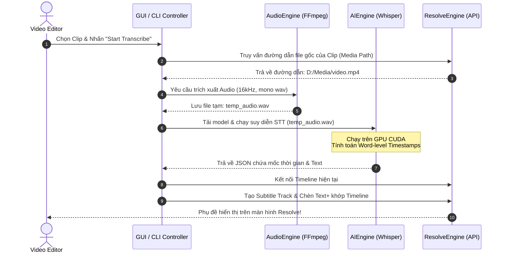

# Tài liệu Thiết kế Hệ thống (System Design Document)
## Dự án: ResolveFlow Assistant (AI Video Automation Suite for DaVinci Resolve)

---

## 1. GIỚI THIỆU (INTRODUCTION)

### 1.1 Mục đích
Tài liệu này đặc tả chi tiết kiến trúc phần mềm, cấu trúc dữ liệu, sơ đồ tuần tự (sequence diagrams), và thiết kế lớp (class design) cho hệ thống **ResolveFlow Assistant**. Tài liệu hướng tới việc lập trình viên có thể đọc và hiện thực hóa (code) các lớp xử lý nghiệp vụ lõi một cách chính xác.

### 1.2 Phạm vi hệ thống
Hệ thống là một ứng dụng Desktop chạy offline, tích hợp với DaVinci Resolve để xử lý hai nhóm tính năng lớn:
1. **AI Subtitle Pipeline:** Audio extraction -> Speech-to-Text (faster-whisper) -> SRT generation -> DaVinci Resolve Text+ injection.
2. **Smart Audio Cut Pipeline:** Audio volume analysis (numpy) -> Silent sections detection -> EDL list creation -> DaVinci Resolve ripple-delete automation.

---

## 2. KIẾN TRÚC TỔNG QUAN (SYSTEM ARCHITECTURE)

Hệ thống tuân theo kiến trúc phân lớp (Layered Architecture) kết hợp mô hình Hướng sự kiện (Event-Driven) đơn giản khi tương tác với DaVinci Resolve qua cổng IPC.

```text
+-------------------------------------------------------------------+
|                           GUI Layer                               |
|        (PyQt5 / Tkinter Dashboard & Progress CLI View)            |
+-------------------------------------------------------------------+
                                 |
                                 v
+-------------------------------------------------------------------+
|                        Application Layer                          |
|         (Orchestrator - Điều phối luồng xử lý chính)               |
+-------------------------------------------------------------------+
           |                     |                     |
           v                     v                     v
+-------------------+ +---------------------+ +---------------------+
|    Audio Engine   | |      AI Engine      | |   Resolve Engine    |
| (ffmpeg, ffprobe) | | (faster-whisper/VAD)| |  (fusionscript API) |
+-------------------+ +---------------------+ +---------------------+
           |                     |                     |
           +---------------------+---------------------+
                                 |
                                 v
+-------------------------------------------------------------------+
|                       Infrastructure Layer                        |
|        (NVIDIA CUDA Runtime, PyTorch Model Cache, Local FS)       |
+-------------------------------------------------------------------+
```

---

## 3. THIẾT KẾ MÔ-ĐUN CHI TIẾT (DETAILED COMPONENT DESIGN)

Hệ thống được chia thành 4 module chính chạy độc lập và giao tiếp qua cấu trúc dữ liệu chuẩn hóa (Pydantic Models):

### 3.1 Module 1: Trích xuất & Xử lý Âm thanh (`src/core/audio.py`)
* **Chức năng:** Trích xuất file audio chất lượng cao (.wav, 16kHz, 16-bit, Mono) từ file video nguồn.
* **Công nghệ sử dụng:** `ffmpeg-python`.

### 3.2 Module 2: Nhận dạng giọng nói offline (`src/core/transcriber.py`)
* **Chức năng:** Tải model Whisper, áp dụng mô hình phát hiện giọng nói (VAD - Voice Activity Detection) để loại bỏ khoảng lặng nhiễu, chạy suy diễn (inference) STT trên nhân CUDA.
* **Công nghệ sử dụng:** `faster-whisper` (CTranslate2), `PyTorch` (CUDA).

### 3.3 Module 3: Tự động hóa DaVinci Resolve (`src/core/resolve_api.py`)
* **Chức năng:** Kết nối qua fusionscript API, tìm kiếm đối tượng dự án, tạo Track phụ đề, sinh block `Text+` tương ứng với mốc thời gian phụ đề.
* **Công nghệ sử dụng:** Blackmagic Design FusionScript SDK (Python).

### 3.4 Module 4: Phân tích sóng âm & Cắt thông minh (`src/core/autocut.py`)
* **Chức năng:** Đọc dữ liệu thô của file wave qua `numpy`, tính toán bình phương trung bình gốc (RMS) trên từng cửa sổ khung hình (frame window), tìm vị trí dưới ngưỡng dB định sẵn, chuyển đổi thành danh sách các khoảng cần giữ lại để gửi sang Resolve API thực hiện cắt dựng.
* **Công nghệ sử dụng:** `numpy`, `scipy`.

---

## 4. SƠ ĐỒ LUỒNG DỮ LIỆU (DATA FLOW DIAGRAM - DFD)

Sơ đồ tuần tự dưới đây mô tả luồng xử lý từ lúc người dùng chọn clip trên Timeline cho đến khi phụ đề được chèn ngược lại DaVinci Resolve:



---

## 5. THIẾT KẾ LỚP CHI TIẾT (CLASS DIAGRAM & SCHEMAS)

Sử dụng thư viện `pydantic` để định nghĩa và kiểm chứng cấu hình đầu vào của toàn bộ ứng dụng:

```python
from pydantic import BaseModel, Field
from typing import Literal, Optional

class ModelConfig(BaseModel):
    model_size: Literal["tiny", "base", "small", "medium", "large-v3"] = "small"
    device: Literal["cuda", "cpu"] = "cuda"
    compute_type: Literal["float16", "int8_float16", "int8"] = "float16"

class SubtitleConfig(BaseModel):
    max_chars_per_line: int = Field(default=42, ge=10, le=80)
    font_name: str = "Arial"
    font_size: int = Field(default=48, ge=10, le=200)
    color_hex: str = "#FFFFFF" # Trắng
    shadow_enabled: bool = True

class AudioCutConfig(BaseModel):
    min_silent_duration: float = Field(default=0.5, description="Giới hạn giây im lặng")
    silence_threshold_db: float = Field(default=-35.0, description="Ngưỡng dB được coi là im lặng")
    padding_seconds: float = Field(default=0.1, description="Độ đệm hai đầu điểm cắt để tránh mất chữ")
```

### Các lớp thực thi lõi (Core Execution Classes)

#### 1. Lớp `AudioExtractor` (`src/core/audio.py`)
* **Phương thức:**
  - `extract_audio(video_path: str, output_wav_path: str) -> bool`: Chạy tiến trình FFmpeg nền trích xuất audio.
  - `get_audio_duration(file_path: str) -> float`: Lấy thời lượng tệp audio để cập nhật thanh tiến trình UI.

#### 2. Lớp `ResolveTranscriber` (`src/core/transcriber.py`)
* **Thuộc tính:**
  - `model: whisper.WhisperModel`: Đối tượng tải mô hình faster-whisper.
* **Phương thức:**
  - `load_model(config: ModelConfig) -> None`: Khởi tạo và đẩy mô hình lên GPU VRAM.
  - `transcribe(audio_path: str) -> list[dict]`: Dịch giọng nói và trả về cấu trúc dữ liệu phân đoạn (segments) chi tiết.

#### 3. Lớp `ResolveAutomation` (`src/core/resolve_api.py`)
* **Phương thức:**
  - `get_current_timeline() -> object`: Kết nối và lấy Timeline hiện hoạt.
  - `insert_subtitle_to_timeline(subtitles: list[dict], config: SubtitleConfig) -> bool`: Vẽ các block Text+ lên Timeline.
  - `apply_ripple_delete_edl(cut_segments: list[tuple[float, float]]) -> bool`: Thực hiện cắt thô hàng loạt các đoạn im lặng dựa trên EDL.

---

## 6. THIẾT KẾ MÃ NGUỒN VÀ TRIỂN KHAI (IMPLEMENTATION STRATEGY)

### 6.1 Tối ưu hóa CUDA & VRAM
Để đảm bảo ResolveFlow Assistant hoạt động ổn định trên các máy trạm có VRAM hạn chế (từ 4GB-6GB):
1. **Compute Type `float16`:** Bắt buộc sử dụng `float16` trên GPU hỗ trợ kiến trúc Tensor Core để tăng tốc tính toán gấp 2 lần và giảm dung lượng VRAM tiêu thụ xuống 50%.
2. **VRAM Garbage Collection:** Sau mỗi tiến trình dịch, gọi hàm giải phóng bộ nhớ PyTorch:
   ```python
   import torch
   import gc
   # Hủy đối tượng model
   del model
   gc.collect()
   torch.cuda.empty_cache()
   ```

### 6.2 Xử lý ngoại lệ (Exception Handling & Fault Tolerance)
* **Resolve API Connection Timeout:** Nếu không kết nối được DaVinci Resolve (do người dùng quên chưa bật "External Scripting" trong Preferences), hệ thống phải thông báo chi tiết cách bật thay vì crash ứng dụng.
* **Missing FFmpeg Dependency:** Khi khởi động, ứng dụng kiểm tra sự tồn tại của `ffmpeg`. Nếu không có, ứng dụng sẽ cung cấp đường dẫn tải tự động và lưu vào thư mục `bin/` nội bộ dự án.
